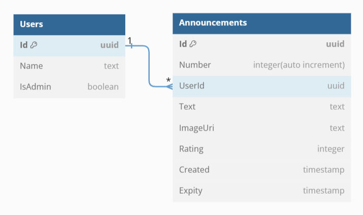

# Web API for managing users and announcement

The project is a set of API methods developed on the ASP.NET platform that implement the management of specific actions: "User" and "Announcement". The API allows you to interact with entity data and perform the operation of insertion, deletion, extraction, search, sorting, filtering, and paging.

## Table of Contents

* [Object model of the domain and its entities](#section-1)
* [Features](#section-2)
  * [User Management](#section-2.1)
  * [Announcement Management](#section-2.2)
  * [Announcement Quantity Limit](#section-2.3)

##  Object model of the domain and its entities

### Fields of the "User" entity:

* Id (type Guid): Unique identifier of the user.
* Name (type string): User's name.
* IsAdmin (type bool): Flag indicating whether the user is an administrator.

### Fields of the "Announcement" entity:

* Id (type Guid): Unique identifier of the announcement.
* Number (type int): Announcement number (e.g., sequential number).
* UserId (type Guid): Identifier of the user who created the announcement.
* Text (type string): Announcement text.
* ImageUri (type Uri): URI link to the announcement image.
* Rating (type int): Announcement rating (e.g., quality rating).
* Created (type DateTime): Date and time of the announcement creation.
* Expiry (type DateTime): Date and time when the announcement expires.

##  Features

###  1. User Management:

+ Get a list of all users with a specific configuration.
+ Get user data based on their identifier.
+ Create a new user.
+ Edit existing user data based on their identifier.
+ Delete a user based on their identifier.

###  2. Announcement Management:

+ Get a list of all announcements with a specific configuration.
+ Get announcement data based on their identifier.
+ Create a new announcement.
+ Edit existing announcement data based on their identifier.
+ Delete a announcement based on their identifier.

###  3. Announcement Quantity Limit:

Each user is allowed to create a specific number of announcements, and the quantity limit is taken from the project settings.
